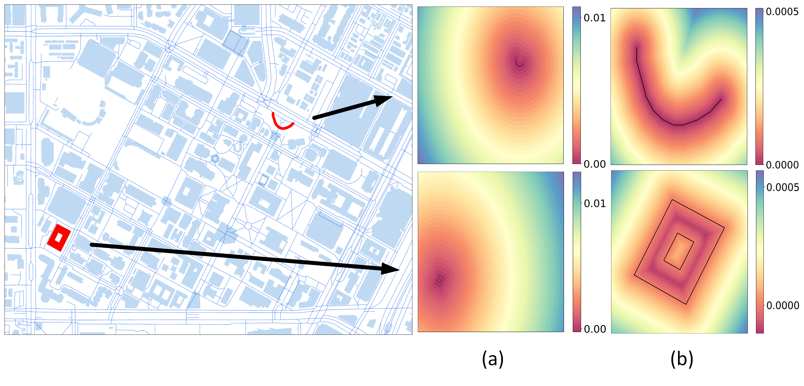

# 🌍 Geo2Vec: Shape- and Distance-Aware Neural Representation of Geospatial Entities

> 🚀 *Building the wheel for next-generation GeoAI* — a moonshot for spatial understanding.

---



---

## 📌 Overview

Spatial representation learning underpins a wide range of **GeoAI applications**—from land-use classification to urban morphology analysis. However, encoding the **shapes, positions**, and **topological relationships** of spatial entities (points, polylines, polygons) remains a challenging task.

### 🧠 Why Geo2Vec?

**Geo2Vec** introducing:
- **Signed Distance Field (SDF)-based encoding**: Points are sampled around spatial entities and encoded by their signed distances (positive outside, negative inside).
- **Adaptive sampling & rotation-invariant encoding**: Enabling rich, geometry-aware and interpretable embeddings.
- **Compact neural approximation** of each shape's SDF.

---

## ✨ Key Features

- 🌀 **SDF-Based Embeddings** — Learn spatial structures through real distance fields.
- 📐 **Adaptive Positional Encoding** — Capture fine detail and structure.
- 🔁 **Rotation-Invariance** — Robust to spatial orientation.
- 🗺️ **Supports multiple geometry types** — Points, lines, and polygons, multipolygon, polygon with holes.

---

## 📊 Applications

- 🏢 Land-use & building classification  
- 🧭 Topology & spatial relation reasoning  
- 📦 Compact vector representations for large-scale geospatial datasets  

---

## 🛠️ Installation

> More setup details will be added soon!

```bash
git clone NeuralRepresentation
pip install -r requirements.txt
