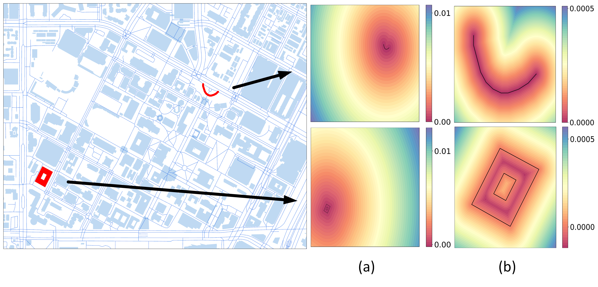

# 🌍 Geo2Vec: Shape- and Distance-Aware Neural Representation of Geospatial Entities

> 🚀 *Building wheels for next-generation GeoAI* — a moonshot for spatial understanding.

**Geo2Vec is accepted as an oral presentation at AAAI 2026!**

---



---

## 📌 Overview

**Spatial Representation Learning** serves as the foundation for a wide range of GeoAI applications. We introduce **Geo2Vec**, a unified spatial representation learning framework for generating **general-purpose** embeddings of geospatial entities.


### 🧠 What is Geo2Vec?

Geo2Vec is a tool for generating informative representations of geospatial entities—including points, lines, multi-line, polygons, multipolygons, and polygons with holes.  
It can extract **global-level** location representations, **fine-grained** geometric representations, or **both**, and these embeddings can be seamlessly used for any downstream GeoAI task, and boost GeoAI model's performance. 

 **Signed Distance Field (SDF)–based representation** — Each entity is converted into a signed distance field. We sample points within this field as training data and train a neural network to model the SDF.


---

## ✨ Key Features

-  **Embeddings without intermediate space** — Learn spatial representation directly from the coordinate space, no feature engineering or fourier transform.  
-  **Adaptive Positional Encoding** — Capture fine detail and complex geometric patterns of geospatial entities.  
-  **Rotation-Invariant Positional Encoding** — Optional module for orientation-invariant shape representations.  
-  **Supports multiple geometry types** — Point, LineString, MultiLineString, Polygon, MultiPolygon, and Polygon with holes.


---

## 📊 Applications

- 🏢 Land-use & building classification  
- 🧭 Topology & spatial relation reasoning  
- 📦 Compact vector representations for large-scale geospatial datasets  
- 🧠 And many more GeoAI applications you can imagine!

---

## 🗺️ Datasets

Datasets used in our experiments can be found in the `data` folder.  
Additional large datasets are available on Google Drive: 
  [Dataset Link](https://drive.google.com/file/d/1lsd0pf2qwMxCL6a6tXFd7m_RxnWEs6bn/view?usp=drive_link).

## Tutorials

Tutorial is updated, you could directly use `tutorial.ipynb` to learn the representation in a more intuitive and instructional way. 

Alternatively, you can prepare your geospatial entities of any type in a list and use the `list2vec` function in `GeoNeuralRepresentation/runners/list2embedding.py` to generate the shape and location embeddings for your entities.

## 🛠️ Installation

> More setup details will be added soon!

```bash
git clone GeoNeuralRepresentation
pip install -r requirements.txt
